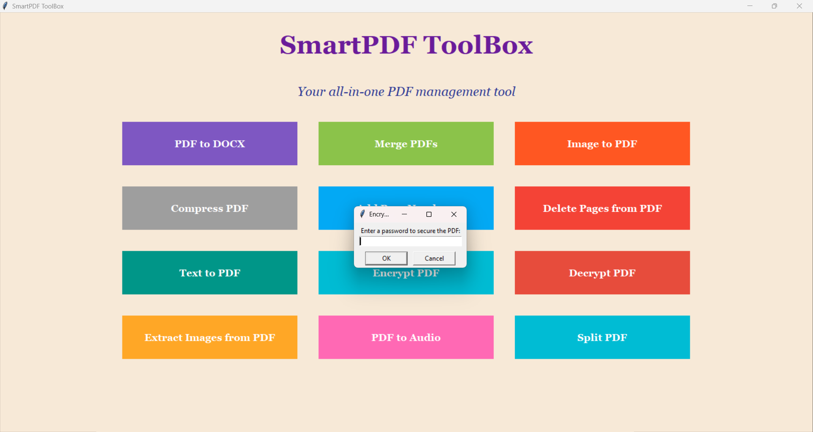
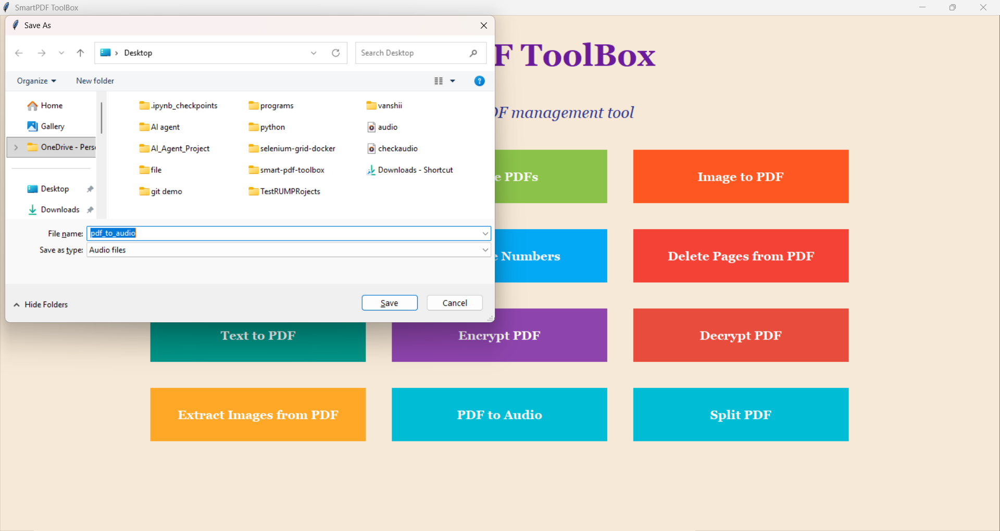
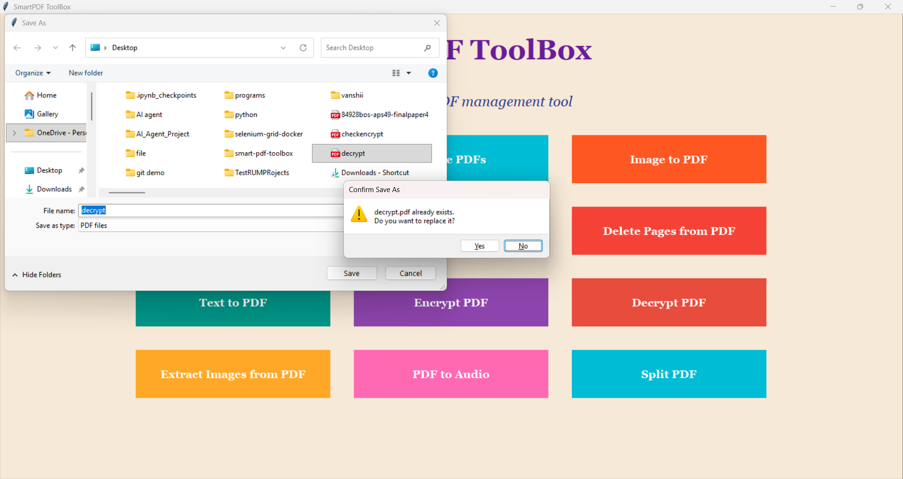

# SmartPDF ToolBox 📄🛠️

**SmartPDF ToolBox** is a Python-based desktop GUI application built using **Tkinter**.  
It provides multiple PDF utilities through a simple and user-friendly interface.

---

## 🔹 Features

- **PDF to DOCX** – Convert PDF files to editable Word documents.
- **Merge PDFs** – Combine multiple PDF files into a single file.
- **Image to PDF** – Convert images (PNG, JPG, BMP, GIF) into PDF files.
- **Compress PDF** – Reduce PDF file size.
- **Add Page Numbers** – Add sequential page numbers to PDFs.
- **Delete Pages** – Remove selected pages from a PDF.
- **Text to PDF** – Create a PDF file from text input.
- **Encrypt/Decrypt PDF** – Secure or unlock PDFs with a password.
- **Extract Images** – Extract all images from a PDF.
- **PDF to Audio** – Convert PDF text into an audio file (MP3).
- **Split PDF** – Split a PDF into individual pages.

---

## 🔹 Technologies Used

- Python 3  
- Tkinter (GUI)  
- PyPDF2 (PDF manipulation)  
- PyMuPDF / fitz (Compression, page numbering, extract images)  
- pdf2docx (PDF → Word)  
- Pillow (Image → PDF)  
- ReportLab (Text → PDF)  
- pyttsx3 (Text → Audio)  

---

## 🔹 Installation & Run

1. Clone the repository:
```bash
git clone https://github.com/vanshikasingla52/smart-pdf-toolbox.git


## 🔹 Screenshots




